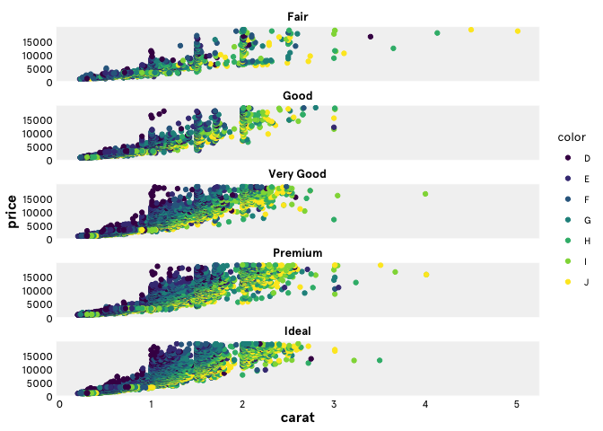

# ceiglobal

<!-- badges: start -->

[](https://www.tidyverse.org/lifecycle/#Experimental)

<!-- badges: end -->

The goal of ceiglobal is to provide an easy to use extension to
`ggplot2` to allow users to easily create beautiful figures consistent
with CEI’s style guide.

## Installation

This is a ‘private’ package that you can only install if you are a
member of the ceiglobal organisation on github. To gain access you will
need a github account and for the administrator to add you.

You can on install this package by running this code below. Note: you
will need the install and load the package `devtools` first. To install
run `install.package("devtools")`, to load run`library("devtools")`.

Install `ceiglobal` by running:

``` r
devtools::install_github("ceiglobal/ceiglobal")
```

## Example

This is a very basic example which shows you how to the package takes a
standard `ggplot2` object and applies CEI’s style guide.

``` r
## LOAD PACKAGES

library(ggplot2)
library(ceiglobal)
#> Loading required package: tidyverse
#> ── Attaching packages ────────────────────────────────────────────────────────────────────── tidyverse 1.3.0 ──
#> ✓ tibble  3.0.0     ✓ dplyr   0.8.5
#> ✓ tidyr   1.0.2     ✓ stringr 1.4.0
#> ✓ readr   1.3.1     ✓ forcats 0.5.0
#> ✓ purrr   0.3.3
#> ── Conflicts ───────────────────────────────────────────────────────────────────────── tidyverse_conflicts() ──
#> x dplyr::filter() masks stats::filter()
#> x dplyr::lag()    masks stats::lag()

## This what a plot looks like using standard ggplot2 output

diamonds %>%
  ggplot() +
  aes(x = carat, y = price, colour = color) +
  geom_point() +
  facet_wrap(~cut, ncol = 1)
```


``` r

## This is what happens when you sprinkle a little bit of cei magic on it

diamonds %>%
  ggplot() +
  aes(x = carat, y = price, colour = color) +
  geom_point() +
  facet_wrap(~cut, ncol = 1) +
  theme_ceiglobal()
```


